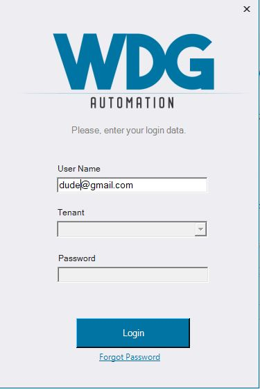
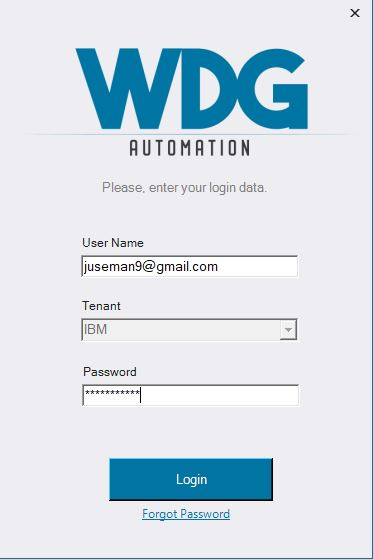
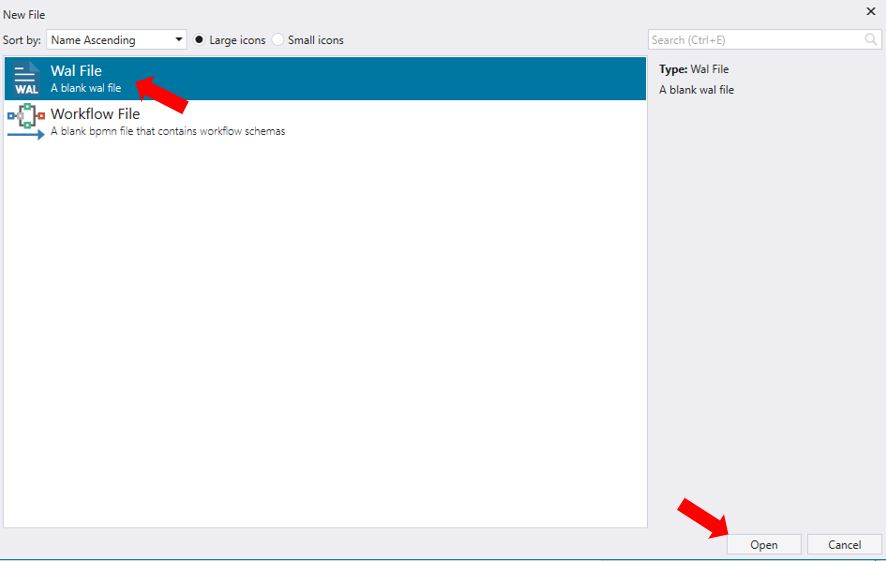

# IBM Digital Business Automation Exercise
## How to build a bot using WDG RPA (Robotic Process Automation)

### Introduction
July 8th, 2020 IBM announced that it will be acquiring WDG Automation to strengthen IBM DBA portfolio (https://newsroom.ibm.com/2020-07-08-IBM-to-Acquire-WDG-Automation-to-Advance-AI-Infused-Automation-Capabilities-for-Enterprises). IBM has been in strategic co-operation with Automation Anywhere (AA), providing IBM RPA with Automation Anywhere RPA solution based on Automation Anywhere RPA platform. Although the co-operation with AA will continue, WDG Automation technology will join the IBM Cloud Integration organization and be available through IBM Cloud Pak for Automation on-premises, and in public or private cloud environments.

This exercise is a copy of current "Build a Bot Tutorial" available in IBM Demos (https://www.ibm.com/cloud/garage/dte/tutorial/build-bot-tutorial) that was originally built for IBM RPA with Auttomation Anywhere.

### Use case
In this exercise you will build a robot to automate processing sales leads that arrive in a CSV/Excel format. Each row of the file represents a separate sales lead. The sales leads need to be manually entered (copy/paste) by an analyst into the online opportunity system of record (JK Automation Sales Leads). This task is error prone and the analysts repeatedly ask if this can be automated, but it has never been a company priority. Until now 😉

### Prerequisites
- Personal WDG Automation Account activated
- WDG Studio installed and configured to your computer

### Exercise instructions
**(1) Start WDG Automation Studio**
- Double-click the `WDG Studio shortcut` in your desktop.

- When the login window opens (might take a while for the first time), type in your username and hit the `Login button`.

- When your tenant name is displayed, type in your password and hit the `Login button` again.

<!--  -->

**(2) Create a new WAL file by clicking the `New` icon from the top toolbar or `New` under "Get Started" section**

- Select `WAL file` (WDG Automation Language) and click `Open`.

**(3) Create your bot script**

You should now have your Studio opened with a empty WAL file in your Designer view. Note that you change your view between Script, Designer and Call Graph.

**(4)** Click on `Launch Watson Assistant`.

---
_Author: Jukka Juselius (jukka.juselius@fi.ibm.com)_
